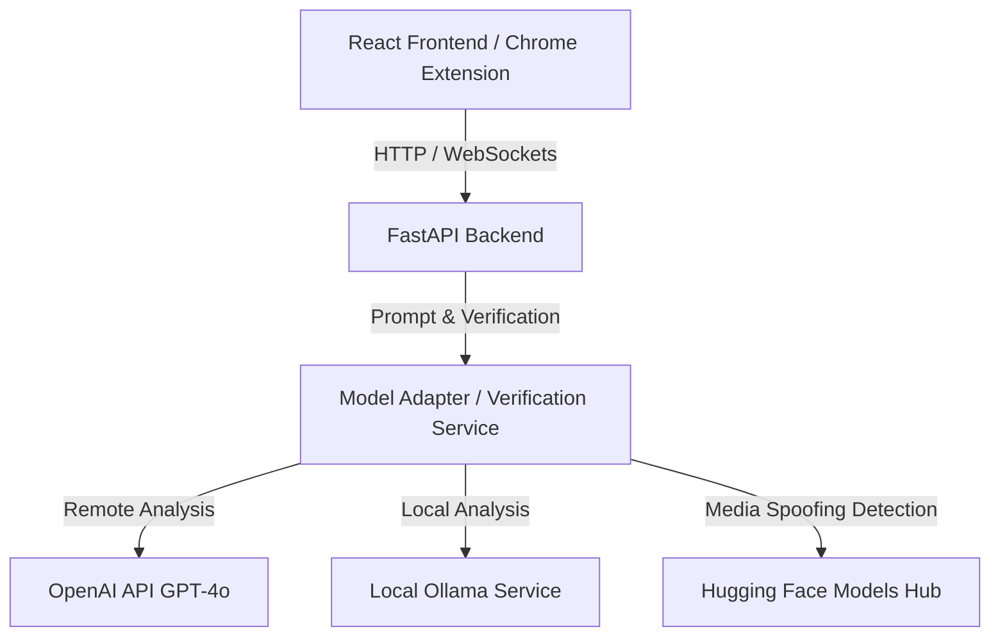

# TruthLens AI

TruthLens AI is a multimodal AI verification platform that detects misinformation, AI-generated media, and synthetic voices using multiple LLMs, computer vision, and speech analysis. It supports OpenAI GPT-4o and local Ollama models through a modular architecture.

## Features

- Multi-LLM Support
- GPT-4o + Ollama
- AI Image Detection
- AI Voice Detection
- Video Verification
- Chrome Extension
- Explainable Trust Score

## Tech Stack

Frontend:
- React
- TailwindCSS

Backend:
- FastAPI

LLMs:
- OpenAI GPT-4o
- Llama 3.2
- Gemma 3
- Mistral
- Phi-3

AI Models:
- Whisper
- Hugging Face Image Detector
- Hugging Face Audio Anti-Spoofing

## Architecture

GitHub automatically renders Mermaid diagrams. Here is the structure of the TruthLens AI platform:




## Installation

### Clone

```bash
git clone https://github.com/OmSons30/TruthLens-AI.git
cd TruthLens-AI
```

### Backend

```bash
cd backend
python -m venv venv
venv\Scripts\activate
pip install -r requirements.txt
```

### Frontend

```bash
cd frontend
npm install
npm run dev
```

### Chrome Extension

To load the Chrome Extension locally:

1. Open Google Chrome and navigate to `chrome://extensions/`.
2. Enable **Developer mode** using the toggle switch in the top-right corner.
3. Click the **Load unpacked** button in the top-left corner.
4. Select the `chrome-extension` folder from the root of the project.

### Ollama

```bash
ollama pull llama3.2
ollama pull gemma3
ollama pull mistral
```

Start Ollama:

```bash
ollama serve
```

### Environment Variables

Create `.env`

```env
OPENAI_API_KEY=xxxxxxxx
OLLAMA_URL=http://localhost:11434
```

## Usage

Run backend:

```bash
uvicorn main:app --reload
python main.py
```

Run frontend:

```bash
npm run dev
```

## Screenshots
1. Dashboard for content verification
   
*Features*   
-Deepfake detection: includes AI synthetic image verification.
-includes fake news detection using text verification.(uses openAi)
-Screen capture option

2. AI synthetic Audio verification.
   

3. Multimodal Chatbot for personalized verification.
   
   
> trust score provided by the model.
   

4. Extension for flexibility of user.
   


## Future Improvements

- Browser Extension
- More LLMs
- RAG
- Better Deepfake Detection

## License

MIT
